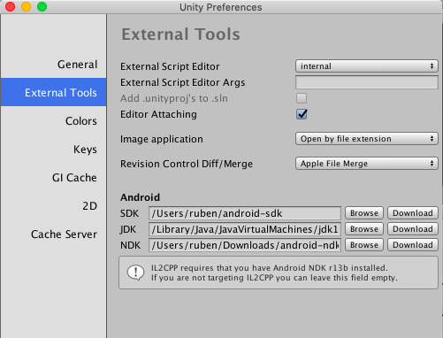

# InfectionAR
a shooting game using Vuforia and Unity for Interactive Video Game Development course in YZU

## Slides
[Game Presentation](https://docs.google.com/presentation/d/1OYLRWO8KrbB8jzwWPo1dnMMDKCwMhgJrxmrYVQVqVD0/edit?usp=sharing)

## Videos

## Import & Compile the project

Follows the steps performed in order to import and compile the project (2021) on MacOS:

1. Download & Install Unity Hub and Unity 2017.2.0f3 that can be found in [Unity Archive](https://unity3d.com/es/get-unity/download/archive)
2. Clone this repo and add `InfectionAR` folder as project from Unity Hub.
3. Open the project and configure Unity:
    - Install Android SDK (through Android Studio), patch it with this [tools](http://dl-ssl.google.com/android/repository/tools_r25.2.5-windows.zip)
    - Install OpenJDK 8
    - Add Vuforia Support to Unity by clicking in Player properties > XR Settings and follow directions from this link: [Unity Forum](https://forum.unity.com/threads/failed-install-of-unitysetup-vuforia-ar-support-for-editor-2018-2-2018-3.614887/)
        - Change /Applications/Unity to /Applications/KAK
        - Move the required install of unity to the Applications folder (in this case 2017.2.0f3)
        - Rename that folder to "Unity"
        - Run the installer package (Vuforia Support)
        - Replace the folders to where they were afterwards, renaming them back to original. 
    - Finally configure external tools in Unity > Preferences > External Tools.

    

4. Create a new keystore:
`keytool -genkey -v -keystore my-release-key.keystore -alias alias_name -keyalg RSA -keysize 2048 -validity 10000`
5. Configure Player Settings with the new keystore.
6. Build for Android Platform.

> Note: No NDK is required, Unity License and project id is required to build the project.

## Tools
* [Unity](https://unity3d.com/)
* [Vuforia SDK](https://www.vuforia.com/)
* [Android SDK](https://developer.android.com/studio/index.html)

## Authors
* **Rosdyana Kusuma**

See also the list of [contributors](https://github.com/rosdyana/InfectionAR/contributors) who participated in this project.

## License
This project is licensed under the MIT License - see the [LICENSE.md](LICENSE.md) file for details

## Contributing
Feel free to contribute.

## Assets
* Zombie's roar - https://freesound.org/people/adharca/sounds/323819/
* Death man sound - https://freesound.org/people/Replix/sounds/173126/
* Soldier 3d model - https://www.assetstore.unity3d.com/en/#!/content/85702
* Donald Trump 3d model - http://www.denysalmaral.com/2016/11/free-lowpoly-donald-trump-3d-character.html
* Zombie in gameplay 3d model - https://www.assetstore.unity3d.com/en/#!/content/30232
* Zombie in menu 3d model - https://www.assetstore.unity3d.com/en/#!/content/101964
* Golden coin 3d model - https://www.assetstore.unity3d.com/en/#!/content/14162
* 100 NTD - scanned by myself for game purpose only.
* 2D gun - screenshoot from C.O.D : MW3 ( I bought this game in steamstore )
* DPAD - Unity Standard Assets
